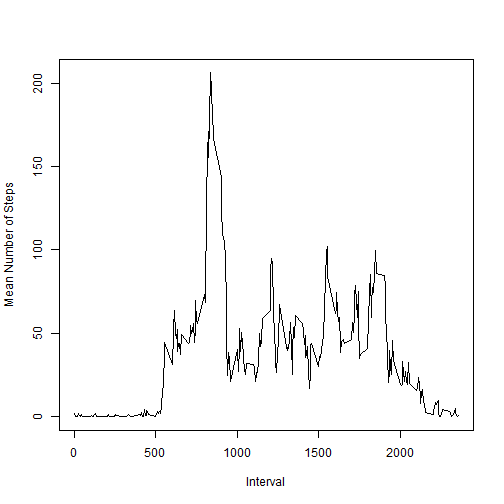

## Loading and preprocessing the data

``` r
# load csv data and transform the date variable to date object if needed
if(!exists('activity') || !is.data.frame(get('activity'))) {
  if(!file.exists("activity.csv")) unzip("activity.zip")
  activity <- read.csv("activity.csv")
  activity$date <- as.Date(activity$date)
}
```


## What is mean total number of steps taken per day?

``` r
totalPerDay <- tapply(activity$steps, activity$date, sum, na.rm = TRUE)
barplot(totalPerDay)
```


``` r
stepsMean <- mean(totalPerDay)
stepsMedian <- median(totalPerDay)
```
The mean of total number of steps taken per day is 9354.23 steps.  
The median of total number of steps taken per day is 10395 steps.

## What is the average daily activity pattern?

``` r
stepsMeanInInterval <-
  tapply(activity$steps, activity$interval, mean, na.rm = T)
plot(names(stepsMeanInInterval), stepsMeanInInterval, type = "l",
     xlab = "Interval", ylab = "Mean Number of Steps")
```


``` r
maximum <- max(stepsMeanInInterval)
maxInterval <- which(stepsMeanInInterval == maximum)
```
The 5-minute interval that contains the maximum number of steps
on average is the 835 interval which contains
206.17 steps on average.

## Imputing missing values

``` r
naCount <- sum(is.na(activity$steps))
missingRows <- which(is.na(activity$steps))
missingIntervals <- activity[missingRows, "interval"]
missingMeans <- stepsMeanInInterval[as.character(missingIntervals)]
activityComplete <- activity
activityComplete[missingRows, "steps"] <- missingMeans
totalPerDayComplete <- with(activityComplete,
                            tapply(steps, date, sum, na.rm = TRUE)
                            )
barplot(totalPerDayComplete)
```



``` r
stepsMeanComplete <- mean(totalPerDayComplete)
stepsMedianComplete <- median(totalPerDayComplete)
```

There are 2304 missing values in the dataset.  
Missing values have been filled in by the mean number of steps in each interval.  
The mean of total number of steps taken per day is
now 10766.19 steps.  
The median of total number of steps taken per day is
now 10766.19 steps.  
Both the mean and the median number of steps taken per day has increased after
imputing the missing values.

## Are there differences in activity patterns between weekdays and weekends?

``` r
library(dplyr)
library(ggplot2)

activityComplete$day.type <- factor(
  weekdays(activityComplete$date) %in% c("Saturday", "Sunday"),
  labels = c("weekday", "weekend")
  )

panelPlotData <- activityComplete %>%
  group_by(interval, day.type) %>%
  summarize(steps = mean(steps))

ggplot(panelPlotData, aes(interval, steps)) +
  geom_line() +
  facet_grid(day.type ~ .) +
  labs(x = "Interval", y = "Mean Number of Steps")
```


